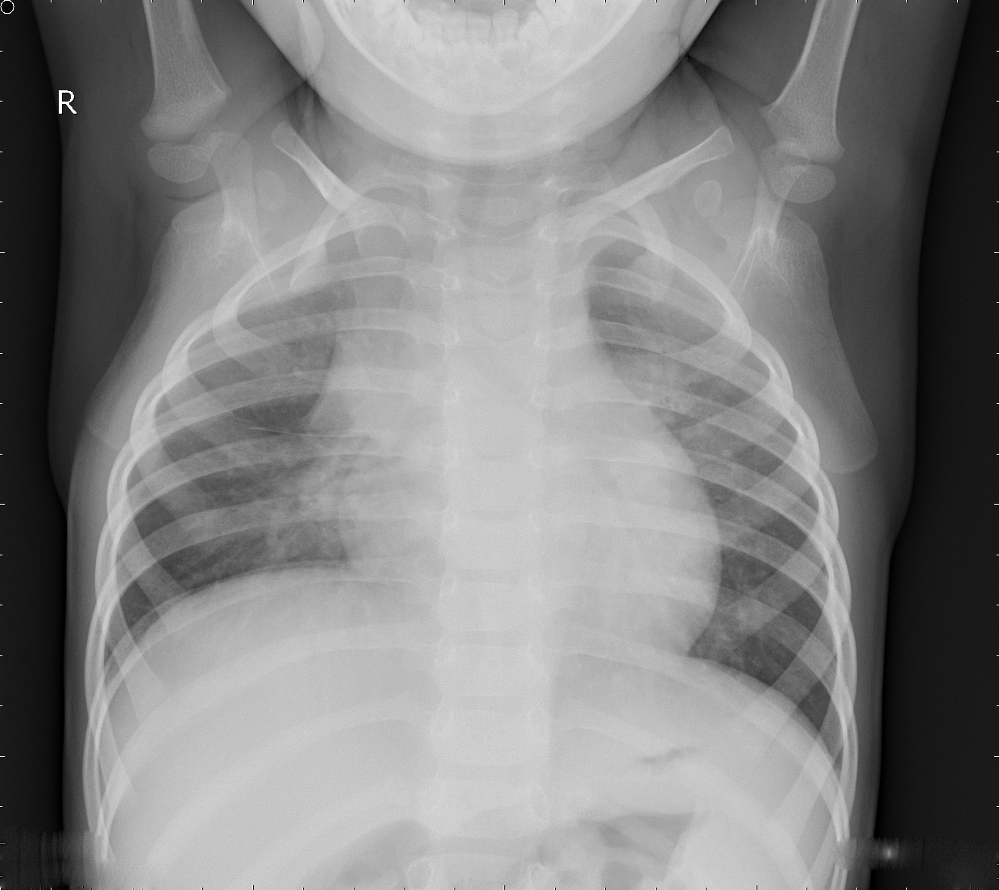
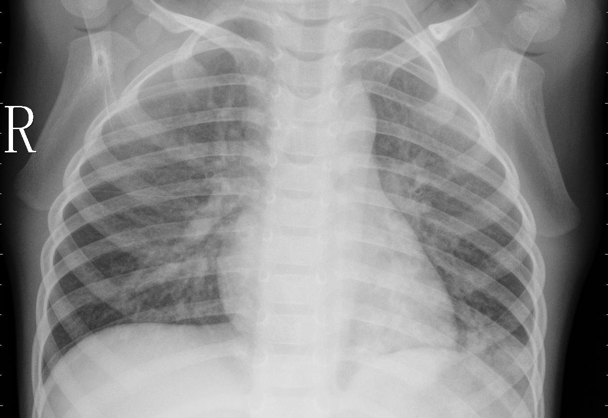

[issue-template]: ../../../issues/new?template=BUG_REPORT.md
[feature-template]: ../../../issues/new?template=FEATURE_REQUEST.md


# VGG19 Pneumonia Diagnosis

This service uses [VGG19](http://www.robots.ox.ac.uk/~vgg/research/very_deep/) 
to detect whether patients have pneumonia, both bacterial and viral, based on an X-ray image of their chest.

This service is based on Alishba Imran's [work](https://github.com/alishbaimran/Pneumonia-Diagnosis-CNN-Model).

It is part of our third party [DNN Model Services](https://github.com/singnet/dnn-model-services).

### Welcome

The service receives an X-ray chest image and uses it as an input for a pre-trained `VGG19` model.

The model was trained using this Kaggle's [dataset](https://www.kaggle.com/paultimothymooney/chest-xray-pneumonia),
and has achieved an accuracy of `77,52%`.

### What’s the point?

The service makes prediction using computer vision and machine learning techniques.

The service outputs `"Pneumonia"` for images that has a probability to have pneumonia or "Normal" otherwise.

### How does it work?

The user must provide the following inputs in order to start the service and get a response:

Inputs:
  - `gRPC method`: check.
  - `img_path`: An X-ray chest image URL.

You can use this service from [SingularityNET DApp](http://beta.singularitynet.io/).

You can also call the service from SingularityNET CLI (`snet`).

Assuming that you have an open channel to this service:

```
$ snet client call snet pneumonia-diagnosis check '{"img_path": "https://snet-models.s3.amazonaws.com/bh/PneumoniaDiagnosis/diagnosis_normal_2.jpg"}'
...
Read call params from cmdline...

Calling service...

    response:
        output: "Normal"
```

### What to expect from this service?

Input image:



Response:
```
output: "Normal"
```

Input image:



Response:
```
output: "Pneumonia"
```